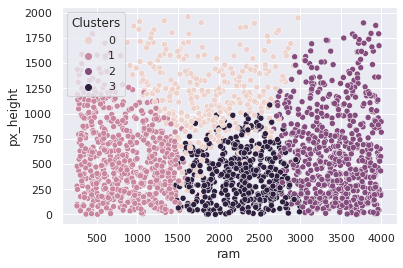
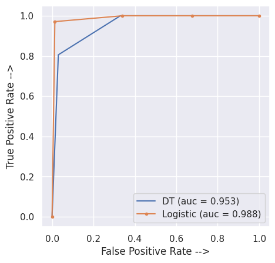

# Khalida_Portfolio
Portfolio of Khalida Sultana Shuravi's Data Science Projects

# [Credit Card Churn Prediction](https://github.com/kshuravi/Credit_Card_Churn_Prediction)
* Predicting a client's probability of churning their credit card account and providing possible solutions to acquire more customers

# [Mobile Price Classification](https://github.com/kshuravi/Mobile_Price_Classification)
* Use of Logistic Regression, Decision Trees and Clustering algorithms to solve the given problem. Comparison of the accuracy scores and AUC curves are shown

# [Marvel vs DC Films EDA](https://github.com/kshuravi/Marvel_vs_DC_Film_EDA)
* Exploratory Data Analysis focused on webscraping and some sweet findings!

# [Oscar Nomination Prediction Model](https://github.com/kshuravi/Oscar_Nomination_Prediction_Model)
* Predicting Marvel and DC Films getting Oscar Nominations based on their ratings
